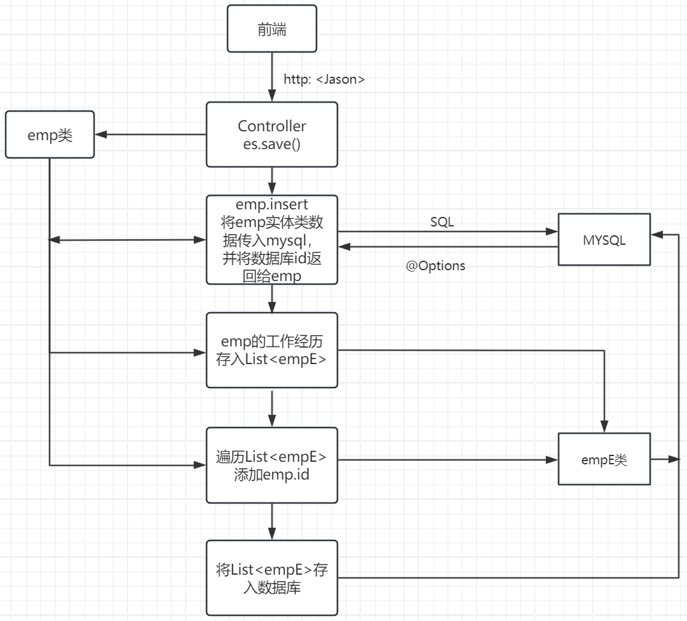
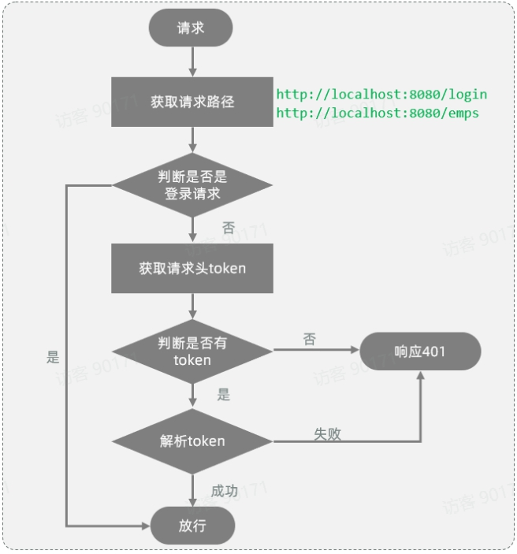
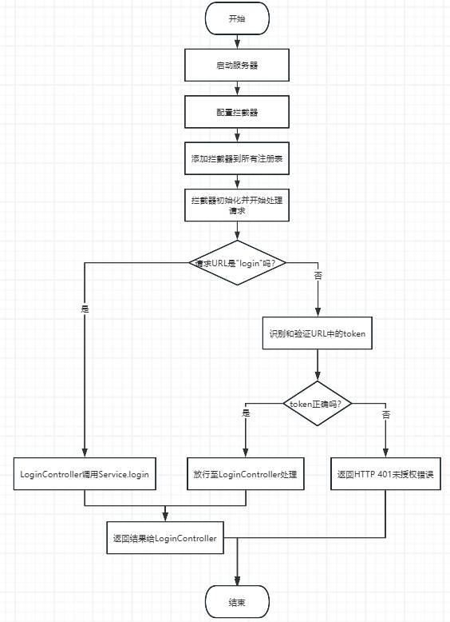

### 教学管理系统项目文档


### 目标和目的

为教育机构提供集成化平台，优化资源配置、简化管理流程，并支持决策制定。功能涵盖部门管理、员工管理、数据可视化及登录认证。


### 技术栈

- **框架**：SpringBoot + SpringMVC + Mybatis
- **数据库**：MySQL
- **工具**：Maven + Apifox
- **反向代理**：Nginx
- **数据可视化组件**：ECharts


### 系统架构

- **Controller**：处理HTTP请求（如`@GetMapping`, `@PostMapping`），调用Service层方法并返回结果。使用`@PathVariable`获取URL中的路径参数。
- **Service**：实现业务逻辑，调用Mapper接口进行数据库操作，并处理事务与权限验证。
- **Mybatis Mapper**：执行数据库的增删改查操作，支持驼峰命名规则映射(`map-underscore-to-camel-case: true`)。


### 部门管理

#### 概述

提供对系统内所有部门信息的维护功能，包括查询、新增、删除和修改部门操作。

#### 实现细节

- **查询**：通过`@GetMapping("/departments")`获取所有部门列表，支持分页和模糊搜索。
- **新增**：通过`@PostMapping("/department")`添加新部门，确保数据的有效性检查。
- **删除**：通过`@DeleteMapping("/department/{id}")`删除指定ID的部门，使用`@PathVariable`获取路径参数{id}，并在删除前检查依赖关系。
- **修改**：分两步——首先使用`@GetMapping("/department/edit/{id}")`查询回显指定ID的部门信息；然后通过`@PostMapping("/department/update")`提交更新后的数据。确保在更新前进行数据有效性和冲突检查。
- **参数接收**：遵循请求参数名与形参变量名一致原则自动封装。字段名不一致时开启驼峰命名规则以支持自动映射。


### 员工管理

#### 概述

涵盖了员工列表查询、分页查询与条件分页查询、新增员工、删除员工以及修改员工等功能，能够有效地管理员工的基本信息和工作经历。

#### 实现细节

- **多表查询**

  - 避免产生不必要的**笛卡尔积**：指在数学中，两个集合(A集合和B集合)的所有组合情况

  - **内连接**：用于查询A表和B表的交集数据。
  - 外连接
    - 左外连接：查询左表所有数据(包括两张表交集部分数据)
    - 右外连接：查询右表所有数据(包括两张表交集部分数据)
  - **子查询**：通过嵌套`SELECT`语句实现更复杂的查询逻辑。

- **分页查询**

  - 前端传递参数
    - 当前页码 (`page`)
    - 每页显示条数 (`pageSize`)
  - 后端响应内容
    - 查询到的数据列表（存储于List集合）
    - 总记录数
  - 使用**PageHelper分页插件**简化分页逻辑，提升开发效率，并保证良好的用户体验。

  ```java
  //1.设置分页参数
  PageHelper.startPage(empQueryParam.getPage(), empQueryParam.getPageSize());
  //2.执行查询
  List<Emp> empList = empMapper.list(empQueryParam);//条件查询参数
  //3.解析结果并封装
  Page<Emp> p = (Page<Emp>) empList;
  return new PageResult<Emp>(p.getTotal(),p.getResult());
  ```

- **新增员工**

  - 同时录入基本信息（对应`emp`表）和工作经历信息（对应`emp_expr`表）。采用批量插入方式保存工作经历信息，提高数据录入效率。
  - 使用**@Transactional注解**确保事务一致性，即要么全部成功提交，要么回滚所有操作，维护数据的一致性和完整性。

  

- **业务处理与事务控制**

  - 事务定义：一组操作作为一个不可分割的工作单位，所有操作要么同时成功，要么同时失败。

  - 事务控制步骤

    - 开启事务 (`start transaction; / begin;`)

    - 提交事务 (`commit;`) 或 回滚事务 (`rollback;`)

  - 场景：一次业务要进行操作多次数据库中数据

    - 银行转账
    - 下单扣减库存

  - 注意事项

    - 加在实现方法上(多次操作数据库)
    - rollbackFor:允许回滚其他异常(默认回滚运行时异常)

  - 事务特性(ACID)
    - 原子性：不可分割的最小单元
    - 一致性： 完成后所有数据保持一致
    - 隔离性：不受外部并发操作影响
    - 持久性：事务的提交与回滚对数据库的改变是永久的

- **删除员工**

  - 删除员工不仅需要从`emp`表中移除员工基本信息，还需从`emp_expr`表中删除相应的工作经历信息。为保证数据完整性，删除操作应在同一事务中完成，确保两者同步更新，避免孤立数据的存在。

  - SQL删除语句：

    ```xml
    <delete id="deleteByids">
      delete from emp where id in
      <foreach collection="ids" item="id" separator="," open="(" close=")" >
        #{id}
      </foreach>
    </delete>
    ```

- **查询回显**

  - 当用户需要编辑员工信息时，首先通过`id`查询并回显当前员工的所有信息。`controller`层接收`id`，调用`service`层方法，再由`service`层调用`mapper`接口获取所需信息。

- **修改员工**

  - 用户修改完员工信息后点击保存按钮，将修改后的数据提交至服务端，并更新数据库中的相关信息。修改过程需同步更新`emp`表的基本信息及`emp_expr`表的工作经历信息。

  - 示例步骤：

    1. 根据`id`修改员工基本信息。
    2. 根据`id`删除员工的工作经历信息。
    3. 插入新的工作经历信息。

    ```java
    //1.根据id修改员工基本信息
    emp.setUpdateTime(LocalDateTime.now());
    empMapper.updateByid(emp);
    //2.根据id删除员工工作经历
    empExprMapper.deleteByempids(Arrays.asList(emp.getId()));
    //3.重新插入员工工作经历
    List<EmpExpr> exprList = emp.getExprList();
    if(!CollectionUtils.isEmpty(exprList)) {
        //遍历集合，为empexpr实体类的empid赋值
        exprList.forEach(empExpr -> {
            empExpr.setEmpId(emp.getId());
        });
        empExprMapper.insertBatch(exprList);
    }
    ```

    

### 数据可视化

#### 组件引入

- **ECharts：**作为前端数据可视化的主要组件，用于展示关键数据指标，如员工分布情况、部门工作量统计等。支持多种图表类型（柱状图、折线图、饼图等）

#### **部门人数统计**

- **Service层数据处理**

  - 通过stream流获取Map并通过键“pos”获取对应值

  ```java
  List<Object> jobList = list.stream().map(dataMap->dataMap.get("pos")).toList();
  ```

- **Mapper层访问数据库**

  - 注意：select A, B from.....返回结果存放在Map集合中，会以A,B分配键，按A,B对应值分配值

  - SQL语句--case流程控制函数

    ```sql
     case when cond1 then res1 [when cond2 then res2] else res3 end;
     -- 若条件1成立返回结果1，若条件2成立返回结果2，否则返回结果3
    ```

- **细节**

  - 系统提示@MapKey is required：插件误报

  - @RequestMapping("/report")：将URL路径为/report的请求映射到方法中进行处理。

#### **性别人数统计**

- **Mapper层访问数据库**

  ```sql
  <select id="countEmGenderData" resultType="java.util.Map">
      select
          if(gender = 1,'男性员工','女性员工')  name,
          count(*) value
      from emp group by gender
  </select>
  ```


### **登录校验**

#### 会话技术

- 访问web服务器资源，会话建立，一次会话包含多次请求与响应。
- **会话跟踪：**识别请求来自同一浏览器，以便共享数据。
- **跟踪方案**
  - 客户端会话跟踪技术：Cookie -- APP端无法使用；用户可删除，不安全；不支持跨域。
  - 服务端会话跟踪技术：Session -- 存于服务器端，安全；服务器集群环境下无法使用；Cookie的所有缺点。
  - 令牌技术： 支持PC与移动；解决集群环境问题；减轻服务器存储；需要自己实现。

- **JWT令牌**

  - 组成
    - hearer：记录令牌类型、签名算法
    - payload：自定义消息、有效时间
    - signature
  - 生成 --Jwts.builder()；
  - 校验 --Jwts.parser();
  - 报错原因：令牌被篡改或过期失效
  - 签名与生产的令牌必须配套

- **过滤器(Filter)**

  -  定义

     - 通过实现类实现接口Filter，需@Override

     - init ：初始化，web服务器启动时执行一次。
     - doFilter：拦截到请求后执行，多次
     - destroy：销毁，web服务器关闭时执行一次。

  -  配置

     - @WebFilter(urlPatterns="")：实现类上定义，指定拦截的请求。
     - @ServletComponentScan：在引导类或启动类定义。开启Springboot对Servlet组件的支持。

  -  放行：chain.doFilter(request,response)

  

  - 过滤器链：按照类名字母排序决定先后执行

- **拦截器(Interceptor)**

  -  定义

     - 通过实现类实现接口HandlerInterceptor，需@Override

     - preHandle：资源方法运行前运行，是否放行
     - doFilter：资源方法运行后运行
     - destroy：最后运行

- **配置**

  - 注册拦截器：配置类(@Configuration)实现接口WebMvcConfigurer
  - 交给IOC容器管理 Component 

- **拦截器与过滤器的异同**

  - 实现逻辑相同。
  - 接口规范不同。
  - 拦截范围不同：Filter拦截所有资源，Interceptor只拦截Spring环境中的资源。

- **运行逻辑**

  - 启动服务器 -  WebConfig.addInterceptors：配置拦截器，将 TokenInterceptor 添加到拦截器注册表中，通过 addPathPatterns("/**") 指定拦截所有 URL 路径。

  - 资源方法运行(客户端请求生效)前 - TokenInterceptor.preHandle 初始化拦截器，逻辑见过滤器图

    - LoginController监听到对应"login"URL，调用Service.login

      login 调用SQL根据用户名和密码查询员工信息，装入HashMap中并生成JWT令牌，将以上信息装箱并返回给Controller

    - preHandle 识别不是"login"，对URL中的token(JWT令牌属性)进行识别并进行相关操作，若正确，放行置LoginController；若错误，返回401。

  


### 反向代理与日志技术

#### **Nginx作为反向代理**

使用nginx:浏览器发起请求，请求的是localhost:90 ，那其实请求的是nginx服务器。

 在nginx服务器中呢，并没有对请求直接进行处理，而是将请求转发给了后端的tomcat服务器，最终由tomcat服务器来处理该请求。

这个过程就是通过nginx的反向代理实现的。 那为什么浏览器不直接请求后端的tomcat服务器，而是直接请求nginx服务器呢，主要有以下几点原因：

- **安全：**由于后端的tomcat服务器一般都会搭建集群，会有很多的服务器，把所有的tomcat暴露给前端，让前端直接请求tomcat，对于后端服务器是比较危险的。
- **灵活：**基于nginx的反向代理实现，更加灵活，后端想增加、减少服务器，对于前端来说是无感知的，只需要在nginx中配置即可。
- **负载均衡：**基于nginx的反向代理，可以很方便的实现后端tomcat的负载均衡操作。

#### **Slf4j日志技术**

采用SLF4J记录应用运行信息，便于调试和监控系统状态。

**步骤**

- **引入配置文件** **`logback.xml`**  
- **记录日志：定义日志记录对象Logger，记录日志**
- 在任何可能出现问题的方法上加注解@Slf4j


参考文档：[概述 - 飞书云文档](https://heuqqdmbyk.feishu.cn/wiki/LYVswfK4eigRIhkW0pvcqgH9nWd)
